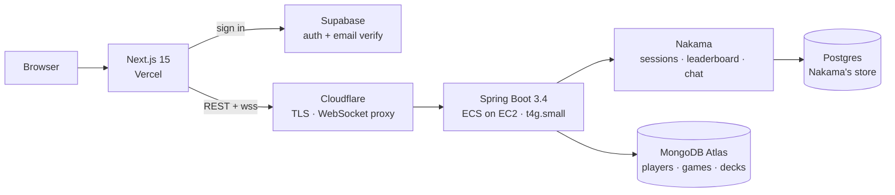

# Hand of Fate

A real-time 1v1 online card game. Two players share a 3×5 board, place cards
under an adjacency constraint, and fight for control of each column.

> **Status:** redeploying. The previous DigitalOcean host was shut down and the
> stack is being moved to ECS on EC2. Live link goes here once it is back up.

---

## The game

Each player starts with a five-card deck — two Sparks (power 1), two Lightnings
(power 3), one Thunder (power 5) — and draws all five as their opening hand.

1. On initialization each player has one random card placed for them: player 1
   at `(1,3)`, player 2 at `(1,1)`.
2. From then on a card may only be placed **orthogonally adjacent to one of your
   own cards already on the board**. This is the whole game — it turns the board
   into a territory fight rather than a free-for-all.
3. Each of the 3 columns is scored independently by total card power. Highest
   power takes the column; equal power ties it and neither player scores.
4. Whoever takes the most columns wins. A player may also request an early win,
   which the opponent can accept or refuse.

Games run about eight moves, so a match is short and positional — closer to a
puzzle than a deckbuilder.

## Architecture



Turn-by-turn play runs over a WebSocket at `/ws/game`. The server holds the
authoritative game state and pushes a **per-player view** of it after every
move, so a client never receives the opponent's hand.

## Stack

| Layer | Choice |
|---|---|
| Backend | Java 17, Spring Boot 3.4.1, Gradle (Kotlin DSL) |
| Realtime | Spring WebSocket, Nakama 3.x |
| Data | MongoDB (game state), Postgres (Nakama) |
| Frontend | Next.js 15, React 19, TypeScript, Tailwind, shadcn/ui |
| Auth | Supabase (email + verification), Nakama sessions |
| Deploy | ECS on EC2 (arm64 / Graviton), Vercel, Cloudflare |
| Observability | Spring Actuator, Micrometer, Prometheus, Grafana |

## Repository layout

```
backend/           Spring Boot service + arm64 Dockerfile
frontend/          Next.js app
infra/local/       local dependency stack (MongoDB, Postgres, Nakama)
infra/monitoring/  Prometheus + Grafana
docs/              deployment notes
```

The backend and frontend were originally two repositories. They were merged with
`git filter-repo --to-subdirectory-filter`, so `git log` and `git blame` remain
continuous across the merge for every file on both sides.

## Running locally

Requires Docker, JDK 17+, and Node 20+.

```bash
# 1. dependencies: MongoDB, Postgres, Nakama
cd infra/local && docker compose up -d

# 2. backend on :8080
cd backend && ./gradlew bootRun

# 3. frontend on :3000
cd frontend && npm install && npm run dev
```

The frontend needs `frontend/.env.local` with a Supabase project URL and anon
key. The backend reads `MONGODB_URI` and the `NAKAMA_*` variables; see
`backend/.env.example`.

> On Apple Silicon and on Graviton, everything runs native arm64. Nakama only
> publishes arm64 images from **3.26.0** onward — older tags are amd64-only and
> will not run on ARM without emulation.

## Tests

```bash
cd backend && ./gradlew test
```

Note that these currently require a live MongoDB, since every test class is a
`@SpringBootTest`. Bringing up `infra/local` first is enough.
